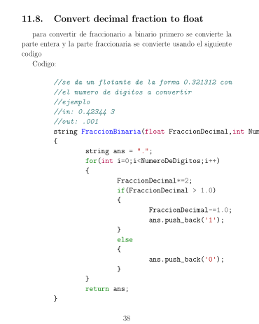

This is a handbook of formulas that I personally use, is ment to be for student's that already passed thouse subjects.
I was inspired by the paretho relation 80% 20% so is as consciese as I could do it

## Electronics Example

## Numerical Calculus Example

## Probability Example


## list of subjects
- algebra
- boolean algebra
- ✨complex Algebra
- Linear Algebra
- Trigonometry
- Differential Calculus
- Integral calculus
- Vector Calculus
- Differential Ecuations
- Probability and statistics
- Numerical calculus
- Arch Linux(pretty much linux in general)
- Latex
- Electronics
- Physics
 Feel free to pull request and to create a branch
## Features
- The document prints an index that is clickable so you can acces the formulas very fast
- all subjects are included in the main file, if you don't want a particular subject you can just delete the import line in the main file
- consice formulas, very bassic formulas are ommited, for example in defferential calculus how to differentiate a constant or x is ommited
- Ilustrations when needed, there are not a lot of ilustrations but there are only the necesary ones to understand a subject before a long time without using it


## Installation
just git clone 
## configuration
if you want to ommit a specific subject just delete the line of the subject in the main file and run:
```
pdflatex --shell-escape configuration.tex
```


## License

MIT

**Free Software, Hell Yeah!**

